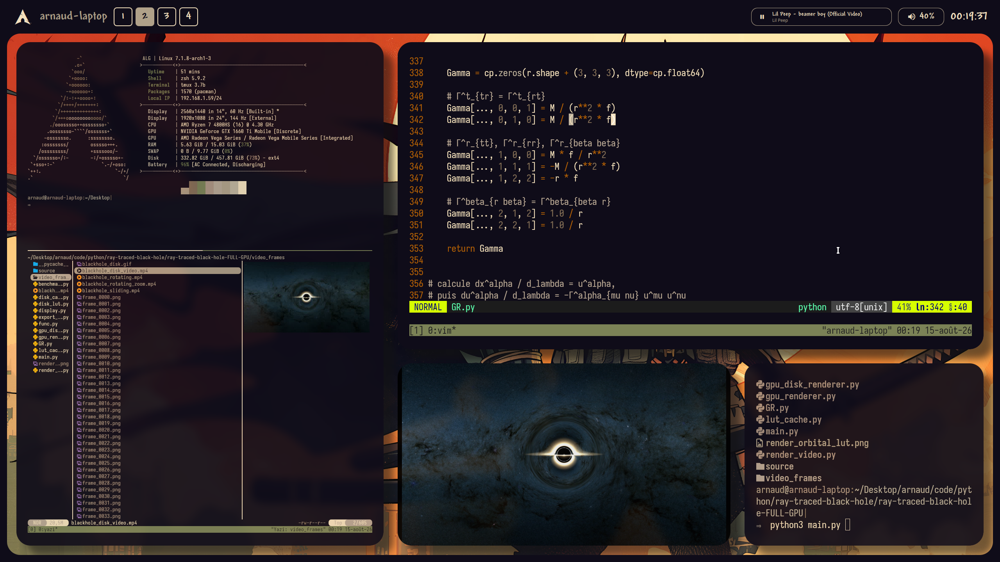

# quickshell-dots
Mmy quickshell config in my  ~/.config/quickshell . Mostly vibe-coded because quickshell is kind of a pain to write.

I am on BSPWM on a distro that has some stuff on top of regular arch linux.

# Demo

